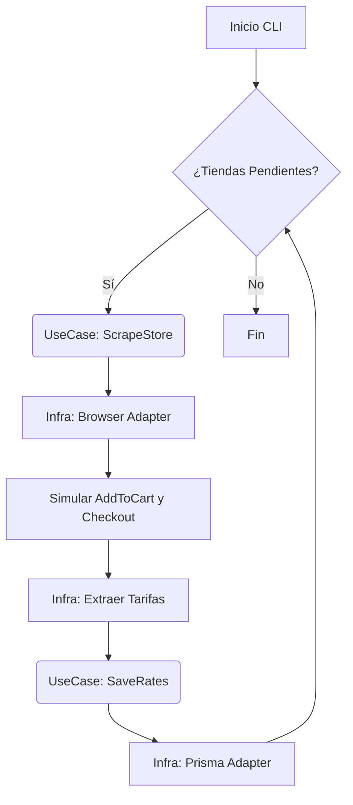

# PRD Técnico: Shopify Shipping Rate Scraper v0.1.0

> **Documento:** Product Requirements Document (Técnico)
> **Fecha:** 2026-01-30
> **Versión:** 0.1.0 (Updated)
> **Autor:** Senior Automation Engineer
> **Estado:** Draft

---

## 1. Visión Técnica y Objetivos

### 1.1 Declaración de Visión

Desarrollar un **sistema automatizado de extracción de tarifas de envío** robusto y escalable, diseñado específicamente para tiendas Shopify en el mercado chileno. El sistema debe simular el comportamiento de un usuario real para obtener datos precisos de costos logísticos en zonas geográficas clave.

### 1.2 Metodología de Desarrollo

El proyecto seguirá un estricto modelo de desarrollo iterativo y validado:
1.  **Planificación por Fase:** Antes de codificar, se debe crear un `implementation_plan.md` detallado.
2.  **Validación Previa:** Se debe solicitar aprobación del usuario sobre el plan antes de comenzar la ejecución ('EXECUTION').
3.  **Ejecución Fase a Fase:** Se avanza una fase a la vez. No se comienza la siguiente hasta terminar la actual.
4.  **Verificación y Revisión:** Al finalizar cada fase, se debe "pedir revisión" al usuario y demostrar funcionalidad (manual o logs) antes de cerrar la fase.
5.  **Lenguaje Obligatorio:** Todo el código fuente debe ser escrito exclusivamente en **TypeScript**. No se permite JavaScript plano.

### 1.3 Alcance del MVP

**Incluido:**
- Iteración sobre lista de URLs de tiendas Shopify.
- Detección dinámica de botones de compra ("Add to Cart").
- Navegación automatizada al Checkout.
- Llenado de formularios con datos simulados para Chile.
- Extracción de tarifas para 3 ubicaciones: Santiago, Til Til, Buin.
- Persistencia de datos en SQLite vía Prisma.
- Modo Headless configurable.

**Excluido:**
- **Pruebas Automatizadas (Unitarias/Integración):** No se implementarán tests automáticos en esta fase (Jest/Vitest excluidos). La validación será manual/logs.
- Extracción de productos específicos (se selecciona el primero disponible).
- Soporte para plataformas no-Shopify.
- Bypassing de captchas complejos (ej. Cloudflare Turnstile agresivo).

---

## 2. Arquitectura del Sistema

### 2.1 Patrón de Diseño: Clean Onion Architecture

El sistema se estructurará siguiendo los principios de Clean Architecture (Onion), separando claramente las responsabilidades en capas concéntricas.

*   **Dominio (Core):** Entidades (`Store`, `ShippingRate`) e Interfaces de Repositorios. Sin dependencias externas.
*   **Aplicación:** Casos de Uso (`ScrapeStoreUseCase`, `ProcessShippingRates`). Orquestan la lógica de negocio.
*   **Infraestructura:** Implementaciones concretas.
    *   *Scraper Adapter:* Implementación de Playwright.
    *   *Database Adapter:* Implementación de Prisma/SQLite.
*   **Presentación / Entry Point:** CLI o script principal que inicia el proceso.

### 2.2 Diagrama de Flujo



---

## 3. Modelo de Datos (Prisma)

```prisma
// schema.prisma

model Store {
  id        String   @id @default(uuid())
  url       String   @unique
  status    String   @default("pending") // pending, processed, error
  lastError String?
  createdAt DateTime @default(now())
  updatedAt DateTime @updatedAt
  rates     ShippingRate[]
}

model ShippingRate {
  id          String   @id @default(uuid())
  storeId     String
  store       Store    @relation(fields: [storeId], references: [id])
  comuna      String   // Santiago, Til Til, Buin
  serviceName String
  price       Float
  currency    String   @default("CLP")
  extractedAt DateTime @default(now())
}
```

---

## 4. Estructura del Proyecto

La estructura de carpetas reflejará la arquitectura Onion:

```
src/
├── domain/                 # Capa de Dominio (Pura)
│   ├── entities/           # Definiciones de Tipos/Clases (Store, Rate)
│   └── repositories/       # Interfaces (IStoreRepository, IScraper)
├── application/            # Capa de Aplicación
│   └── use-cases/          # Lógica de Negocio (ScrapeStore, SaveRates)
├── infrastructure/         # Capa de Infraestructura (Adaptadores)
│   ├── scraper/            # Implementación Playwright (Browser, Navigator)
│   ├── database/           # Implementación Prisma
│   └── config/             # Variables de entrono, Configuración
└── main.ts                 # Entry Point (Inyeccion de Dependencias)
```

---

## 5. Especificación Funcional

### 5.1 Estrategia de Selectores (Infraestructura)
La implementación de Playwright debe ser resiliente:
- **Add to Cart:** Búsqueda por texto flexible ("Agregar", "Comprar", "Add") o selector de formulario `/cart/add`.
- **Checkout:** Navegación forzada a `/checkout` si es necesario.
- **Formularios:** Inyección de valores en inputs con `name="address[...]"` o selectores específicos de apps de envíos chilenas.

### 5.2 Flujo de Validación (Casos de Prueba)
Al ejecutar el scraper, se probarán secuencialmente:
1.  **Caso A:** Santiago (RM)
2.  **Caso B:** Til Til (RM)
3.  **Caso C:** Buin (RM)

Se considera éxito si se extraen tarifas o el sitio indica explícitamente falta de cobertura.

---

## 6. Plan de Implementación (Fases)

### Fase 1: Setup & Domain Definition
- Configuración de TypeScript y Prisma (SQLite).
- Definición de Entidades de Dominio (`Store`, `Rate`).
- Definición de Interfaces (`IScraper`, `IRepository`).
- *Validación:* Compilación exitosa y generación de esquema DB.

### Fase 2: Application Layer
- Implementación de Casos de Uso (`ScrapeStoreUseCase`).
- Lógica de orquestación (Loop de tiendas).
- *Validación:* Tests manuales con "Mocks" de infraestructura (sin navegador real aún).

### Fase 3: Infrastructure - Scraper (Playwright)
- Implementación concreta de `IScraper` usando Playwright.
- Lógica de detección de botón y checkout.
- Llenado de formularios.
- *Validación:* Ejecución visual (headed) verificando la navegación correcta.

### Fase 4: Infrastructure - Database & Integration
- Implementación de repositorios Prisma.
- Inyección de dependencias en `main.ts`.
- Ejecución completa del flujo.
- *Validación:* Verificar datos persistidos en `dev.db`.

---

**Nota:** Cada fase requiere aprobación del plan antes de código y revisión al finalizar.
